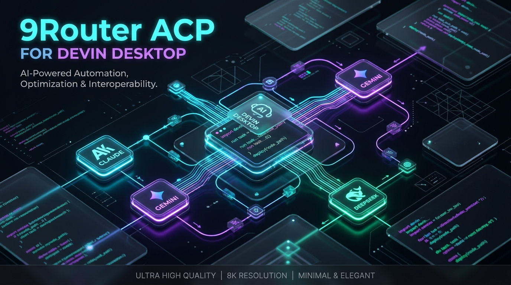

<p align="center">
  
</p>

<h1 align="center">🌐 9Router Portable ACP Agent for Devin Desktop</h1>

<p align="center">
  <b>Jembatan Agent Client Protocol (ACP) portabel berkecepatan tinggi yang menghubungkan Devin Desktop (Cognition AI) langsung ke server 9Router AI Gateway.</b>
</p>

<p align="center">
  
  
  
  
</p>

---

## 🚀 Sekilas Pandang (Overview)

**9Router ACP** adalah server perantara mandiri (**100% Zero External NPM Dependencies**) yang mengimplementasikan protokol **Agent Client Protocol (ACP)** via streaming NDJSON stdio. 

Paket ini memungkinkan **Devin Desktop** menggunakan model-model unggulan dari 9Router (seperti Claude 3.7 / Sonnet 4.6, Gemini 3.8 Flash / Pro, DeepSeek V4, Mistral Codestral, dsb.) dengan kapabilitas autonomous coding penuh di mesin lokal Anda.

<p align="center">
  
</p>

---

## ✨ 4 Fitur Superpowers

### 1. 👁️ Auto-Vision Bridge (Membaca Screenshot Error Otomatis)
* Walaupun Anda memakai model koding murni seperti **Claude Sonnet 4.6**, server ACP akan otomatis mengekstrak teks error visual, HTTP status code (404/500), dan elemen UI dari screenshot Anda menggunakan **Gemini Vision**. 
* Claude tidak akan pernah lagi berkata *"Saya tidak melihat gambar"*.
* Screenshot otomatis disimpan di folder proyek: `.devin_attachments/screenshot_[timestamp].png`.

### 2. 🧠 Smart Rolling Window & Context Pruning (Anti Crash Token)
* Mencegah crash error `400 INVALID_ARGUMENT` saat sesi koding berjalan puluhan langkah.
* Log terminal lama diringkas secara cerdas; riwayat instruksi awal dan 10–14 langkah terbaru selalu terjaga di zona aman (~60k–100k token).

### 3. ⚡ ACP Queue Unblocker & Interruption Handling
* Mendukung penuh `session/cancel` dan `$/cancel_request`.
* Jika pesan Anda tersangkut di antrean *"1 message queued"*, cukup klik tombol **Stop / Pause** di Devin, dan pesan antrean Anda akan **seketika langsung dieksekusi tanpa menunggu**.

### 4. 🛡️ Bundled Hermes QA & Bug Hunting Skills
Telah dilengkapi skill bawaan standar Hermes Agent di folder `bundled-skills/`:
* 🧪 **`dogfood`**: Pengujian otomatis sistematis web app di browser/terminal, cek link putus, cek console error, dan pembuatan laporan bug.
* 🥊 **`adversarial-ux-test`**: Roleplay user kritis untuk menguji skenario ekstrem, validasi form kosong, boundary values, dan potensi crash.
* 🔍 **`systematic-debugging`**: Investigasi akar masalah (root cause) 4-fase sebelum menyentuh atau memodifikasi kode.
* 🚦 **`test-driven-development`**: Penulisan automated test suite sebelum implementasi logika fitur.
* 📋 **`writing-plans`**: Perencanaan arsitektur tugas besar menjadi sub-langkah terukur sebelum dieksekusi.

---

## 📥 Panduan Instalasi Cepat (1-Click Setup)

Paket ini **100% Portabel**. Anda cukup menyalin atau mengklon folder `devin-9router-acp` ini ke komputer mana pun:

### Langkah 1: Prasyarat
* Komputer memiliki **Node.js (versi 18+)** terinstal ([Unduh Node.js](https://nodejs.org)).
* Aplikasi **Devin Desktop** sudah terpasang.

### Langkah 2: Konfigurasi API Key
Salin berkas `.env.example` menjadi `.env` lalu masukkan API Key 9Router Anda:
```env
ROUTER_HOST=your-router-host-or-ip.com
ROUTER_PORT=8080
ROUTER_API_KEY=sk-xxxxxxxxxxxxxxxxxxxxxxxxxxxxxxxx
ROUTER_MODEL=ag/claude-sonnet-4-6
```

### Langkah 3: Pasang Otomatis (1-Click)

#### 🪟 Pengguna Windows:
Cukup klik ganda (double-click) berkas:
```cmd
install.bat
```
*(Skrip otomatis memeriksa Node.js, mendeteksi lokasi folder saat ini, dan mendaftarkan agent ke registry Devin Desktop).*

#### 🍎 Pengguna macOS / 🐧 Linux:
Buka terminal di dalam folder ini dan jalankan:
```bash
chmod +x install.sh
./install.sh
```

---

## 🔍 Menguji Koneksi (Diagnostic Tester)

Ingin memastikan gateway 9Router dapat dijangkau dari jaringan Anda sebelum membuka Devin?

* **Windows**: Klik 2x `test-connection.bat`
* **macOS / Linux**: Jalankan `node test-connection.js`

Contoh keluaran sukses:
```text
========================================================
  🔍 Menguji Koneksi ke 9Router Gateway
========================================================
- Target Gateway : http://your-router-host-or-ip.com:8080
- Default Model  : ag/claude-sonnet-4-6
--------------------------------------------------------
Sedang menghubungi server 9Router...
✅ KONEKSI BERHASIL! (Respon: 200 OK dalam 45ms)
Ditemukan model aktif di 9Router:
  1. [ag/claude-sonnet-4-6]
  2. [ag/gemini-3.8-flash-high]
  3. [nvidia/deepseek-ai/deepseek-v4-pro]
  ...
Server 9Router siap digunakan untuk Devin Desktop!
========================================================
```

---

## 🎯 Mengaktifkan di Devin Desktop

1. Buka aplikasi **Devin Desktop**.
2. Buka menu **Settings** $\rightarrow$ tab **Agents**.
3. Centang dan pilih **9Router AI**.
4. Klik tombol **Reload ACP Connections** (atau restart Devin Desktop).
5. Buat sesi baru di Devin, dan agen 9Router siap bekerja!

---

## 💡 Contoh Prompt Pemanggilan Skill Hermes

Setelah Anda selesai membuat fitur atau halaman website di localhost, Anda bisa meminta Devin untuk menguji kodenya secara mandiri:

* **Pengujian Bug Otomatis:**
  > *"Tolong jalankan **skill dogfood** untuk menguji website di `http://localhost:3000`, periksa konsol error dan buat laporan temuannya."*

* **Uji Ketahanan UX & Form:**
  > *"Gunakan **skill adversarial-ux-test** untuk menguji alur pengisian form registrasi dan tombol submit dengan data tidak valid."*

* **Investigasi Error Sulit:**
  > *"Terapkan **skill systematic-debugging** untuk melacak penyebab error 500 ini sebelum mengubah file backend."*

---

## 🏗️ Struktur Direktori

```text
devin-9router-acp/
├── assets/
│   ├── banner.jpg            # Hero visual banner
│   └── features.jpg          # Diagram 4 superpowers
├── bundled-skills/           # Hermes QA skills bawaan
│   ├── adversarial-ux-test/
│   ├── dogfood/
│   ├── systematic-debugging/
│   ├── test-driven-development/
│   └── writing-plans/
├── .env.example              # Template konfigurasi aman
├── install.bat               # 1-click installer Windows
├── install.sh                # 1-click installer macOS/Linux
├── register.js               # Auto-registrar core engine
├── run-acp.bat               # Manual batch runner
├── run-acp.sh                # Manual shell runner
├── server.js                 # Core ACP Stdio Server (Zero-deps)
├── test-connection.bat       # Diagnostic batch runner
├── test-connection.js        # Health check tester
└── README.md                 # Dokumentasi lengkap
```

---

## 📄 Lisensi

Didistribusikan di bawah lisensi MIT. Bebas digunakan, dimodifikasi, dan didistribusikan untuk keperluan personal maupun komersial.
